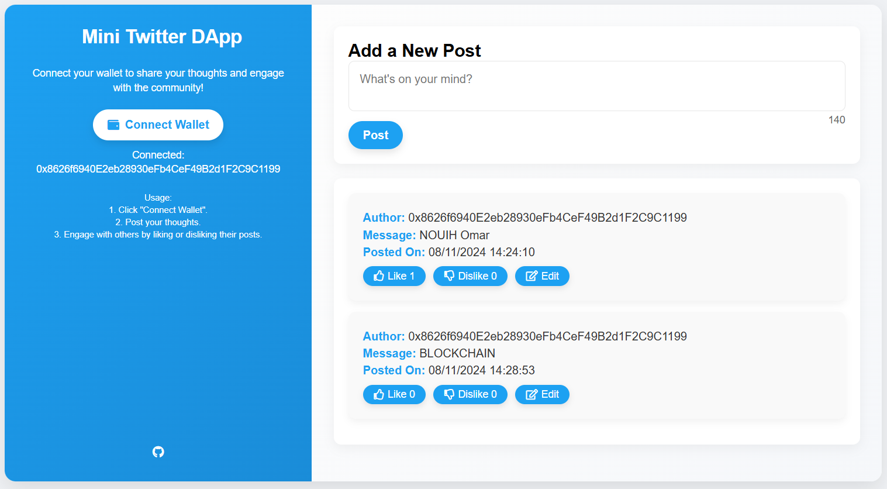
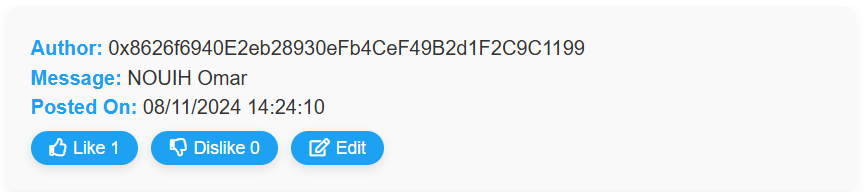

# Blockchain Projects Repository

This repository contains two blockchain-based projects developed as part of a Master’s program in Artificial Intelligence and Data Science at Abdelmalek Essaadi University. The projects focus on decentralized applications (DApps) using smart contracts written in Solidity.

## Project 1: Mini Twitter DApp

### Overview
The **Mini Twitter DApp** is a decentralized application that allows users to post, edit, like, dislike, and comment on messages in a blockchain environment. The application uses Solidity for the backend smart contract and Web3.js for interaction with the Ethereum blockchain.

### Features
- **Post Messages**: Users can publish short messages (up to 140 characters).
- **Edit Posts**: Only the original author can edit their post.
- **Like/Dislike System**: Each post can receive likes or dislikes.
- **Commenting**: Users can add comments to posts.
- **Author Identification**: Displays the author’s Ethereum address for each post and comment.

### Technologies Used
- **Solidity**: Smart contract programming.
- **Web3.js**: JavaScript library for blockchain interaction.
- **HTML/CSS/JavaScript**: Frontend development.

### Usage
1. **publishPost**: Adds a new post to the DApp.
2. **editPost**: Allows the author to edit their post.
3. **addLike/addDislike**: Adds a like or dislike to a post.
4. **addComment**: Adds a comment to a post.

### Deployment
The DApp is designed to run on a local Ethereum test network using MetaMask and Ganache for development and testing.

### Repository
For full source code and further details, please refer to this GitHub repository.

---

## Project 2: MiniSocial Smart Contract

### Overview
The **MiniSocial Smart Contract** is a Solidity-based contract that creates a decentralized social platform. It enables users to publish posts, like posts, and comment on them, with each action recorded on the blockchain.

### Features
- **Post Messages**: Users can post messages with a maximum of 140 characters.
- **Like System**: Allows users to like posts, ensuring each user can like a post only once.
- **Commenting**: Users can add comments to posts, which can also receive likes.
- **Ownership Verification**: Each post and comment is associated with the author’s Ethereum address.

### Smart Contract Details
- **Events**: The contract emits events like `NewPostEvent` and `PostUpdatedEvent` to log actions on the blockchain.
- **Data Structures**:
  - `Post` structure for storing post details.
  - `Comment` structure for storing comments on posts.
- **Functions**: Includes functions for posting, liking, commenting, and retrieving posts and comments.

### Deployment
The contract is deployed on a virtual machine (VM) for testing purposes, avoiding Ethereum gas costs. This setup provides a sandbox for experimentation.

### Usage
1. **publishPost**: Creates a new post.
2. **editPost**: Allows the author to modify their post.
3. **addLike**: Adds a like to a post.
4. **addComment**: Adds a comment to a post.

### Contact
For more details on each project, please refer to the documentation and source code in this repository.

---

## Developer Information

These projects were developed by **Omar Nouih**, under the supervision of **Pr. Ikram BenadbeloUahab**, during the 2024-2025 academic year.
